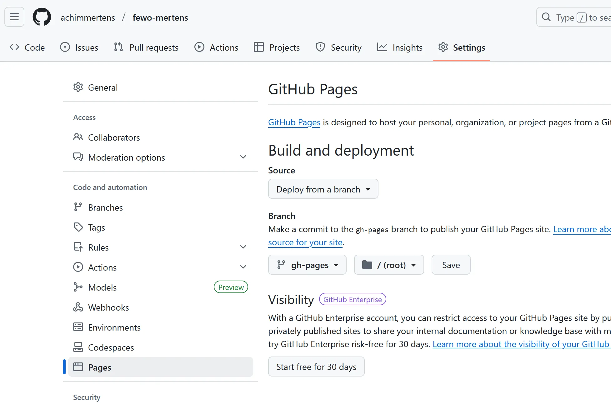
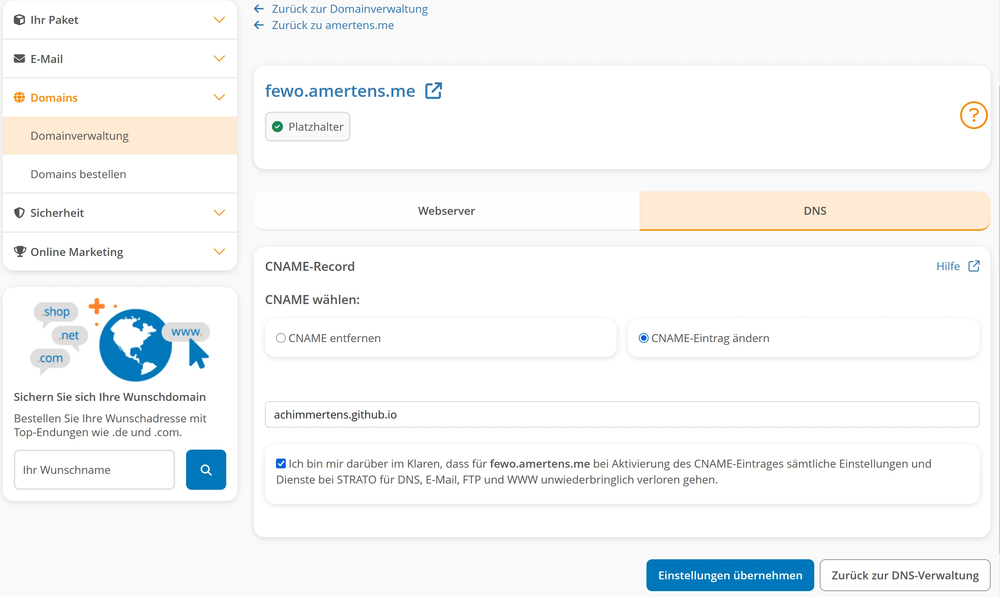

# Schritt-für-Schritt: GitHub Pages für eine Node.js-Webseite einrichten
🧱 Beispiel: Du hast ein Projekt mit z. B. Vue.js, Vite oder React
1. Seite lokal bauen

In deinem Projektordner:

npm install
npm run build

➡️ Das erzeugt einen Ordner (z. B. dist/ oder build/), der die statische Version deiner Seite enthält.

1.1 Regelmäßige Updates
Die Browserliste muss alle paar Monate mal aktualisiert werden, damit die Seite auf aktuellen Browsern gut läuft.

Dazu sollten folgende Befehle ausgeführt werden:

npm update caniuse-lite
npm audit fix
npm run build
npm run deploy

dist-Ordner löschen (optional):
1.2 Build überprüfen
Vor dem Deployment kannst du den Build lokal testen. Dieses Projekt verwendet TanStack Start mit SSR, deshalb wird kein einzelnes `index.html` erzeugt, sondern ein Server unter `dist/server/index.js`, der die gerenderten HTML-Assets aus `dist/client/assets` liefert.

- dist-Ordner löschen (optional):

  ```bash
  rm -rf dist/
  npm run build
  ```
- Preview starten (startet den gebauten Server, der direkt die Routen rendert):

  ```bash
  npm run preview -- --host 0.0.0.0 --port 4173
  ```

  Alternativ:

  ```bash
  npx http-serve dist
  ```

➡️ Dann im Browser `http://localhost:4173` öffnen und testen. Ein statischer HTTP-Server auf `dist/` funktioniert nicht, weil `index.html` fehlt.

2. Den statischen Build auf einen separaten Branch pushen

GitHub Pages kann Inhalte aus einem Branch wie gh-pages anzeigen.
Dazu kannst du das Paket gh-pages nutzen:
a) Installieren:

npm install --save-dev gh-pages

b) In deiner package.json:

Füge Folgendes hinzu:

"scripts": {
  "predeploy": "npm run build",
  "deploy": "gh-pages -d dist"
}

(ersetze dist durch deinen Build-Ordnernamen)
c) Deployment:

npm run deploy

➡️ Dadurch wird dein dist-Ordner auf den Branch gh-pages gepusht und öffentlich verfügbar gemacht.
3. GitHub Pages aktivieren

Gehe auf deine Repository-Seite bei GitHub

Klicke auf Settings > Pages

Wähle bei Source den Branch gh-pages und ggf. den Ordner /root aus


Speichern 
Nach ein paar Sekunden ist deine Seite unter:
https://dein-github-nutzername.github.io/repository-name/

🌍 4. Eigene Domain (z. B. amertens.me) verbinden
a) CNAME-Datei erstellen

Lege im dist/-Ordner (vor dem Deployment) eine Datei namens CNAME an mit folgendem Inhalt:

amertens.me

Dann wird diese Datei bei npm run deploy mit hochgeladen.

Da dies immer wieder überschrieben wird, machen wir das automatisch in der package.json Datei:
```
"name": "vite_react_shadcn_ts",
  "private": true,
  "homepage": "https://fewo.amertens.me",
  "version": "0.0.0",
  "type": "module",
  "scripts": {
    "dev": "vite",
    "build": "vite build",
    "build:dev": "vite build --mode development",
    "lint": "eslint .",
    "preview": "vite preview",
    "predeploy": "npm run build && echo fewo.amertens.me > dist/CNAME",
    "deploy": "gh-pages -d dist"
  },
```

b) Domain bei deinem Provider (Strato) umstellen:

- Logge dich bei Strato ein
- Gehe zum DNS-Editor für amertens.me
- Erstelle einen CNAME-Eintrag für www mit folgendem Ziel:
  dein-github-nutzername.github.io.

(Beispiel: achimmertens.github.io. – Punkt am Ende ist wichtig bei manchen DNS-Systemen)

Für die root-Domain (amertens.me ohne www) musst du ggf. A-Records setzen, oder einen Redirect von Strato auf www.amertens.me einrichten (Strato kann das).



🧪 Testen

Nach ein paar Minuten sollte deine Webseite unter amertens.me erreichbar sein.

5. Pflege und Updates

git tag -a v1.0.0 -m "Erstes Release"


# 📝 Zusammenfassung
- npm run build	 -> Statischen Build erstellen
- npm run deploy -> Mit gh-pages auf GitHub hochladen
- GitHub Settings > Pages	Branch gh-pages auswählen
- CNAME-Datei ->	Domain festlegen
- DNS bei Strato ->	CNAME auf github.io setzen